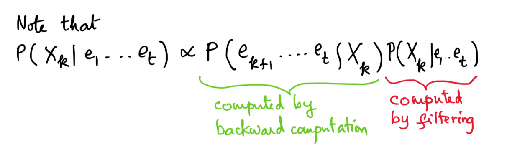

# Study Guide

# Lecture Topics (for the second half of the semester)
1. Trees
2. Ensembles
	3. Gradient Boosting
4. Graphical models (HMMs, )
5. K-means clustering
6. Gaussian Mixture Models
7. Principal Component Analysis and Kernel PCA
8. The Reenforcement Learning Problem and relationship to Markov Decision Processes
9. Temporal Difference Learning

# P1 Topics

1. forward backward pass of HMMs
2. EM
3. simple neural network stuff
4. SVMs
5. k-means
6. Simple PCA: compute small covariance matrix and find the eigens

# P2 Topics 
1. graphical models
2. reinforcement learning

## Random Forest & Decision Trees

### Decision Trees

### Random Forests

* Random forest is just an ensemble of random decision trees

### Random Forest vs. Decision Tree

* What makes a random forest random? How does ensembling happen? why is it good? If you have a bunch of weak classifiers, they might make different classification mistakes. That means that individual mistakes diminish. So the averages will remain. Randomness is important. Look into the subtleness of how it works.
* More trees is usually better. Could be more biased. Usually in practice people use 1000 trees. People don't usually go above 1000. Having deep trees is much more likely to be bad than having a wider set of trees.

### Ensembling, Boosting, and Bagging

* The more segmentations of your data you do, the more specific you make your classifier. If there are a lot of decision boxes, then your trees are too deep.
* When bagging, always sample with replacement. If you don't replace, you're adding a lot of systematic bias.
* Boosting and bagging: Average vote is a great. 
* Know bagging. It's pretty testable.

### Potential Test Question
You might be given a toy dataset to use a decision tree on, but no one is going to ask you to do a random forest. For anything related to forests, just talk about one classifier and why it's not enough, or why more trees would help, or what we be good or bad about more trees.

## Neural Networks

### How to count parameters for CNN: maxpool and convolution layers

### What the differences between activation functions (ReLU, sigmoid, tanh)

For the sigmoid function, the $\sigma$ function becomes flat when it nears 0 or 1. Thus a weight in the final layer will learn slowly if the output neuron is either low activation or high activation. It is common to say that the output neuron has *saturated* and, as a result, the weight has stopped learning (or is learning slowly).

### [The Four Fundamental Equations of Backprop](http://neuralnetworksanddeeplearning.com/chap2.html#the_four_fundamental_equations_behind_backpropagation )

The fundamental idea of backprop is $\frac{\partial C}{\partial w}$ the derivative of the Cost function $C$ with respect to weights (or biases) in the network.

$w^l_{jk}$: the weight for the connection from the $k$th neuron in the $(l - 1)^{th}$ layer to the $j^{th}$ neuron in the $l^{th}$ layer. (This is a little unituitive notation. Make sure that this makes sense before proceeding.)

$z^l := w^la^{l-1} + b^l$: the weighted input to the neurons in layer $l$

$z^l_j = \sum_k w^l_{jk}a^{l-1}_k + b^l_j$

$a^l = \sigma(z^l)$ the activation of layer $l$

The Hadamard product $(s ⊙ t)$: denotes elementwise product of two vectors. $(s ⊙ t)_j = s_jt_j$ 

**Error in the output layer, $\delta^L$**

Element-wise:
$$\delta^L_j = \frac{\partial C}{\partial a^L_j}\sigma'(z_j^L)$$

Vectorized:
$$\delta^L = \nabla_aC ⊙ \sigma'(z_j^L)$$

$\frac{\partial C}{\partial a^L_j}$ measures how fast the cost changes as function of the $j^{th}$ output activation $a^L_j$. $\frac{\partial C}{\partial a^L_j}$ will vary based on the cost function. (softmax, quadratic, etc.)

$\sigma'(z_j^L)$ measures how fast the activation function $\sigma$ is changing at $z_j^L$

**Error $\delta^l$ in terms of the error in the next layer $\delta^{l+1}$**

$$\delta^l = ((w^{l+1})^T\delta^{l+1}) ⊙ \sigma'(z^l)$$

$(w^{l+1})^T\delta^{l+1}$ moves the error backward from the next layer to the current layer.

$\sigma'(z^l)$ moves the error back from the "front" of layer to the "back" of the layer, through the activation function.

**Rate of change of Cost with respect to any bias $b$ in the network**

Element-wise:
$$\frac{\partial C}{\partial b^l_j} = \delta^l_j$$

Shorthand:
$$\frac{\partial C}{\partial b} = \delta$$

The derivative of the cost with respect to the bias is just the error $\delta$.

**Rate of change of cost with respect to any weight in the network**

$$\frac{\partial C}{\partial w^l_{jk}} = a^{l-1}_k\delta_j^l$$

Less index-heavy:

$$\frac{\partial C}{\partial w} = a_{in}\delta_{out}$$

$a_{in}$ is the activation of the neuron input to the weight $w$ and $\delta_{out}$ is the error of the neuron output from the weight $w$. Remember that $w$ describes the edges between two layers of nodes, not the layers themselves.

### Additional Comments

* It would be good to have the forward and backwards passes on a cheatsheet
* Don't expect to need to write convolutional equations in math form. Just know them at a high level. More than likely, you will have to be able to forward and backword pass for neural networks

## What is EM (expectation maximization)?

*An explanation of EM as related to k-means.*

Lets review EM. In EM, you randomly initialize your model parameters, then you alternate between (E) assigning values to hidden variables, based on parameters and (M) computing parameters based on fully observed data.

**E-Step:** Coming up with values to hidden variables, based on parameters. If you work out the math of chosing the best values for the class variable based on the features of a given piece of data in your data set, it comes out to "for each data-point, chose the centroid that it is closest to, by euclidean distance, and assign that centroid's label." The proof of this is within your grasp! See lecture.

**M-Step:** Coming up with parameters, based on full assignments. If you work out the math of chosing the best parameter values based on the features of a given piece of data in your data set, it comes out to "take the mean of all the data-points that were labeled as c."

So what? Well this gives you an idea of the qualities of k-means. Like EM, it is provably going to find a local optimum. Like EM, it is not necessarily going to find a global optimum. It turns out those random initial values do matter.

from [Stanford CS221](http://stanford.edu/~cpiech/cs221/handouts/kmeans.html)

For a more detailed explanation (pages 2-6): [EM high level explanation](http://cs229.stanford.edu/notes/cs229-notes8.pdf
)

### Applying EM to Gaussian Mixture Models

E-step: learn the probability of gaussians:

$w_j^{(i)} = Q_i(z^{(i)} = j) = P(z^{(i)} = j | x^{(i)}; \phi, \mu, \Sigma)$
Where $Q_i(z^{(i)} = j)$ is the probability that $z^{(i)}$ takes the value $j$ in the distribution $Q-i$.

M-step: Maximize with respect to $\phi, \mu, \Sigma$ 

This is just MLE stuff. The math is too complicated type out, but essentially:

1. Take the log likelihood of the distribution including the $Q_i$ (the probability function of the latent variable). 
2. Take the derivative w.r.t. each parameter needed to maximize, and set equal to zero.
3. Solve for each variable. (May have to use langrangian for variables with constraints).

### [In-depth explanation of GMMs Devika referenced](https://jakevdp.github.io/PythonDataScienceHandbook/05.12-gaussian-mixtures.html)

## HMMs

For when you have a sequence of observations and a sequence of hidden states that generated those observaions, and you want determine the most likely set of underlying hidden states.

* $e_t$: an obsevation
* $x_t$: a hidden state
* $\pi$: the initial state probability matrix (P(X_0 = X))
* $a$: hidden state transition probabilities (probability from going from one hidden state to another)
* $b$: emission probability (probability of emitting observation given hidden state)

HMM defined by set S, O and probabilites params $[\pi, a, b] = \lambda$

1. Sample $ X\_0 $ from $ P(X\_0) $ which is $\pi$
2. Repeat for t = 1...T
	1. Sample x\_t from P(X\_t | X\_{t-1}) which is a
	2. Sample e\_t from P(e\_t | X\_t) which b

You observe a sequence of emissions. What is the probability of the hidden state of the last state given the previous emissions ($P(X_5 | h h h t t)$)?

You know $S,O, \lambda(\pi,a,b)$

### HMM Forward Pass (filtering)
To find the probabillity of the most T-th hidden state given 1,...,T emission states.

$\alpha_t(i) := P(e_1,...,e_t, X_t = s_i)$ (the probability of observing sequence of emissions and $X_t$ being $s_i \in S$

1. $\alpha_0(i) = \pi_i$
This is basically saying that the 0-th state is the initial state probability.

2. $\alpha_{t+1}(j) = b_j(e_{t+1}) \sum^n_{i=1}\alpha_t(i)a_{i,j}$
This is basically saying that after the 0-th state, to find the probability that X is in the hidden state $j$ at time $t+1$, you:
	1. look at the joint probability of emmitting state $e_{t+1}$ given the hidden state $j$
	2. Multiply the emission probability $b_j(e_{t+1})$ by the sum of all probabilities of the possible paths to get to this hidden state given all the possible previous states. 

### HMM backward Pass (smoothing)
This is about finding the probability of a hidden state $X_k$ $(k < t)$ given all the emissions from $1$ to $t$.

This probability is proportional to $P(e_{k+1},...,e_t | X_k)P(X_k|e_1,...,e_t)$

$\beta_k(i) := P(e_{k+1},...,e_t | X_k = s_i)$ the probability of the next t - k + 1 emissions given the current hidden state

1. $\beta_T(i) = 1$ the probability of no more emissions given the end state
2. $\beta_k(i) = \sum^n_{j=1}a_{ij}b_j(e_{t+1})\beta_{k+1}(j)$ the probability of the transition from the next state to the current state multiplied by the emission of the next state multiplied by the $\beta$ value of the next state, summed over all $j$ next states.

### Learning the parameters of an HMM

Case 1: When you are given the observation and the hidden state sequences:

* $\pi$: Count $x_0$s
* $a_{ij}$: $\frac{\text{count of } si \rightarrow sj}{\text{count of } si}$
* $b_j(O_k)$: $\frac{\text{count of } O_k \text{ associated with }s_j}{\text{count of } s_j}$ where $O_k$ is an emmission pair ($x_t, e_t$)

Case 2: When you are given only the observation state sequence:

Find a $\lambda$ that maximizes $P(e_1,...e_t | \lambda)$. I.e. find the set of $(\pi,a,b)$ that maximizes the probability of the provided sequence. Use the Baum-Welch EM (expected maximization) algorithm.

$\zeta_t(i,j) = P(X_t = s_i, X_{t+1} = s_j | e_1,...,e_T, \lambda) = 
\frac{\alpha_t(i)a_{ij}b_j(e_{t+1})\beta_{t+1}(j)}{\sum^n_{i=1}\sum^n_{j=1}\alpha_t(i)a_{ij}b_j(e_{t+1})\beta_{t+1}(j)}$

$\nu_t(i) := P(X_t = s_i | e_1,...,e_T, \lambda) = \sum^n_{j=1}\zeta_t(i,j)$ The sum over all possible $X_{t_1}$ states.

The expected number of times $s_i$ is visited in total then is:
$\sum_{t=1}^{T-1}\nu_t(i)$

The expected number of transitions from $s_i$ to $s_j$ is:
$\sum^{T-1}_{t=1}\zeta_t(i,j)$

### Baum-Welch Algorithm
1. Guess $\lambda_0 = [\pi_0, a_0, b_0]$
2. Calculate $\alpha$, $\beta$ from $\lambda$ 
3. Reestimate $\lambda$ from $\alpha$, $\beta$ 
4. Repeat 2 and 3 until convergence

## PCA

### [PCA explanation online that Devika referenced](http://sebastianraschka.com/Articles/2014_kernel_pca.html)

**Principal Components:** new axes of the dataset that maximize the variance along those axes (i.e. the eigenvectors of the covariance matrix). 

Its main purpose is to reduce the dimensions of the dataset with minimal loss of information. The dataset is project onto a new subspace of lower dimension.

There are 6 steps to PCA:

1. Compute the covariance matrix of the original d-dimensional datset $X$.
2. Compute the eigenvectors and eigenvalues of the dataset.
3. Sort the eigenvalues by decreasing order.
4. Choose the $k$ eigenvectors that correspond to the $k$ largest eigenvalues where $k is the number of dimensions for the new feature subspace.
5. Construct the projection matrix $W$ of the $k$ selected eigenvectors.
6. Transform the original dataset $X$ to obtain the k-dimensional feature subspace $Y$: $$Y= W^T \cdot X$$

### Computing the covariance matrix of $X$

$$X^TX$$

<!-- Pretty sure the section below is not needed...

### [Computing the covariance matrix of the original d-dimensional datset $X$](https://math.stackexchange.com/questions/710214/how-to-construct-a-covariance-matrix-from-a-2x2-data-set?utm_medium=organic&utm_source=google_rich_qa&utm_campaign=google_rich_qa)

$\bar x$ = means along the row dimension of $X$ (squash the columns).

$\bar y$ = means along the column dimension of $X$ (squash the rows).

For a 2x2 $X$, the variance-covariance matrix has the following structure:

$$\begin{bmatrix}
var(x) & cov(x,y)\\
cov(x,y)& var(y)
\end{bmatrix}
$$

where $var(x)=\frac{1}{n−1}∑(x_i−\bar x)^2$ and $cov(x,y)=\frac{1}{n−1}∑(x_i−\bar x)(y_i−\bar y)$.

For:

$$ X|y = \begin{bmatrix}
3 & |7\\
2& |2
\end{bmatrix}
$$

* $\bar x=\frac{(3+2)}{2}=\frac{5}{2}$
* $\bar y=\frac{(7+4)}{2}=\frac{11}{2}$
* $var(x)=(3−\frac{5}{2})^2+(2−\frac{5}{2})^2$
* $var(y)=(7−\frac{11}{2})^2+(4−\frac{11}{2})^2$
* $cov(x,y)=(3−\frac{5}{2})(7−\frac{11}{2})+(2−\frac{5}{2})(4−\frac{11}{2})$

-->
### [Computing the eigenvalues and eigenvectors of a 2x2 matrix](http://lpsa.swarthmore.edu/MtrxVibe/EigMat/MatrixEigen.html)

[Of a 3x3](http://wwwf.imperial.ac.uk/metric/metric_public/matrices/eigenvalues_and_eigenvectors/eigenvalues2.html)

### [The Kernel Trick and PCA](http://sebastianraschka.com/Articles/2014_kernel_pca.html)
It is possible to use a kernel trick (and preferable if the data is not easily linearly separable).

Commonly used is the [RBF (gaussian radial basis function) Kernel](https://en.wikipedia.org/wiki/Radial_basis_function_kernel): $$K(x,x') = exp(\frac{-||x-x'||^2}{2\sigma^2})$$ where $\sigma$ is a free parameter.

### Additional discussion
After you're done transforming your data, does the new data correlate to understandable features? No, not really. It doesn't really mean anything anymore because you transformed it by its eigenvectors.

## K-means Clustering
K-means clustering is a form of unsupervised learning (used to explore data structure, outliers and better understand features). K-Means is really just the EM (Expectation Maximization) algorithm applied to a particular naive bayes model.

The goal is to partition the data into K clusters such that the inter-point distances within each cluster are minimized.

### Objective Cost Function

$$ J = \sum^m_{i=1}\sum^K_{k=1}z_k^{(i)}||x^{(i)} - \mu_k||^2$$

* $\mu_k$: the "centroid" or D-dimensional center of cluster $k$
* $z_k^{(i)}$: $1$ if $x^{(i)}$ in cluster $k$, $0$ otherwise

$J$ then is the sum of all of the euclidean distances between the centroids and the datapoints that are assigned to their respective centroids.

### High level K-means clustering algorithm (from [this](https://home.deib.polimi.it/matteucc/Clustering/tutorial_html/kmeans.html) great, simple explanation):

1. Place K points (randomly) into the space represented by the objects that are being clustered. These points represent initial group centroids.
2. **E-Step:** Assign each object to the group that has the closest centroid. 
3. **M-step:** When all objects have been assigned, recalculate the positions of the K centroids.
4. Repeat Steps 2 and 3 until the centroids no longer move. This produces a separation of the objects into groups from which the metric to be minimized can be calculated.

### More in-depth description of K-means algorithm

**E-Step: assigning points to clusters**

* $J$ is linear in $z$ **(why does this matter?)**
* each $x^{(i)}$ is independent **(is this an assumption or a fact?)**
* Calculate the addional cost for the value of $k$ for each point $x^{(i)}$
* Select the value of k that has the smallest value for J
$$z_k^{(i)} = 1 \text{ if } k = \text{argmin}_j ||x^{(i)} - \mu_j||^2; 0 \text{ otherwise}$$

**M-Step: relocate the centroids**

* $J$ is quadratic in $\mu$ **(again, why does this matter?)**
* each $x^{(i)}$ is independent **(again, is this an assumption or a fact?)**
* To minimize $J$ keeping $z$ fixed, take the derivative wrt to $\mu$ and set equal to 0: $$2 \sum^N_{i=1}z_k^{(i)}(x^{(i)} - \mu_k) = 0$$
$$\mu_k = \frac{\sum_iz_k^{(i)}x^{(i)}}{\sum_i z_k^{(i)}}$$

$\mu_k$ is the sum of the values of the points assigned to cluster $k$ divided by the number of data points assigned to cluster $k$ (i.e. the value of the average point)

### Choices

**Choosing K**

**Choosing initial cluster means**

**Choosing Distance Function**

### Important discussion about K-means clustering
**High Level**

* Convergence is guaranteed. Though, the minimum may be local and not global.
* However, results produced depend on the initial values for the means, and it frequently happens that suboptimal partitions are found. The standard solution is to try a number of different starting points.
* It can be slow since it is O(mK) (compute distance for each point for every cluster)

**Pros**

* Kind of scalable O(mk)
* Effective
* Guaranteed to converge

**Cons**

* distance metric
* vulnerable to outliers and midpoints
* may find local minimum
* dependent on initial choices
* clusters can become empty (no datapoints are in a cluster)
* each point can only be assigned to a single cluster

**Best for**

* Convex shapes
* Similar-sized clusters
* Much smaller K value than number of datapoints

## Reenforcement Learning

### Q-Functions

### Value Iteration

# Notes (aka "word vomit") from Gunny OHs

Mostly, just stud that Gunny talked about that would likely be on the exam. The information has/will be augmented into the rest of the study guide.

## The Likely Structure of the Exam
If you have 6 questions:

* you will probably have 1 question from the past. 
Testable things from the past include variations of linear model, logistic model, general linear models. Take something that extends upon something extensions of basic gaussian models. Think about the stuff that she talks about that are extended upon.
* you'll have you that's very general, basic stat concepts. 
* The remaining 4 will most likely be NN, decision trees, em and k-means, pca. 
* HMM is like a bit of hit or miss, RL bit of hit or miss.

## Neural Networks

* how to count parameters for CNN, maxpool, convolution layers
* activation functions tend to do (ReLU, sigmoid, tanh)
* on cheatsheet, it would be good to know how to do the forward backward pass
* not expecting to write convolutional equations in math form. Might be able to forward and backword pass for neural networks
* To understand the 4 fundamental equations of backprop: [Explanation of Backprop](http://neuralnetworksanddeeplearning.com/chap2.html#the_four_fundamental_equations_behind_backpropagation)

## EM Algorithm & GMMixture Models

* know how to work the E-step and M-step
* M step is doing maximization (MLE on Q function)
* K-means and EM are very connected
* K-means assumes gaussians
* Just think about K-means and Gaussian

[EM high level explanation](http://cs229.stanford.edu/notes/cs229-notes8.pdf
)

## Random Forest & Decision Trees

* random forest is just ensemble of random decision trees
* you might be given a toy dataset to use a decision tree on, but no one is going to ask you to do a random forest. Just talk about one classifier and why it's not enough, or why more trees would help, or what we be good or bad about more trees
* Do classification along each axis
* RF vs. DT: what makes a random forest random? How does ensembling happen? why is it good? If you have a bunch of weak classifiers, they might make different classification mistakes. That means that individual mistakes diminish. So the averages will remain. Randomness is important. Look into the subtleness of how it works.
* The more spaces you make the more specific you can make your classifier. Your trees are too deep.
* Bagging. Always sample with replacement. If you don't replace, you're adding a lot of systematic bias.
* More trees is usually better. Could be more biased. Usually in practice people use 1000 trees. People don't usually go above 1000. Having deep trees is much more likely to be bad.
* Boosting and bagging. Average vote is a great. 
* Know bagging. It's pretty testable.

## Graphical Models (HMMs)

* bayes nets
* hmms
* most-easily testable is HMMs
* 4 main algorithms: what we really want to know is the forward and backward pass. EM HMM probably is too complicated to be tested on.
* back pass is basically the reverse of the forward
* any state is based on states on before and after, so it is very computationally expensive
* Might get a toy dataset with 5 datapoints. Now initialize, do forward pass, do backward pass. The math should be super easy.

## Basic MLE

* Know your way through basic calculus. Probably won't be super complicated. Only as hard as simple beta model

## PCA

* Covariance matrix is always $X^TX$
* Basically eigenvalue decomposition. Every time you think of PCA, just think of eigenvectors.
* You are basically doing dimensionality reduction in a very mathematical way.
* After you're done, you don't really have the original features. Does it correlate? No. It doesn't really mean anything anymore because you just have eigenvectors.

## Random things that are important

Reenforcement Learning: 

* understand what a Q function is and understand how the training process works. You might be asked to do one or two steps of a trainining simulation. Could be qualitative questions?
* Know neural work update algorithms in principle at a high level maybe, and why they're better than SGD. (adam, rmsprop)
* The more complex your optimization plane, the more intricate of an update rule you 
* Slide 23 GLM. Know pretty generally how it works.

Bring a calculator to feel more comfortable and to check your work

## Bias vs. variance
Bias is equivalent to underfitting and variance is equivalent to overfitting. Think about your classifier as a policeman. He can be biased. He is very likely to do the same thing no matter what data he sees. But if high variance, then look at everything at a very detailed level and case-by-case.

Increase in bias, is increase in generality prediction. Increase in variance, is increase in sensitivity to change.

High bias tries to fit to a preconceived model. High variance will try more to fit the data exactly. There is always a tradeoff. This is where tuning comes in.

## Additional Suggestions
* Run through Value iteration (Slide 57 for class 4/18) (mdp for RL.pptx)

## Questions
Is this a typo? Shouldn't it be $P(X_k | e_1...e_k)$ for the second part?

"The expected number of transitions from $s_i$ to $s_j$ is:
$\sum^{T-1}_{t=1}\zeta_t(i,j)$" Why is it the expected number?

